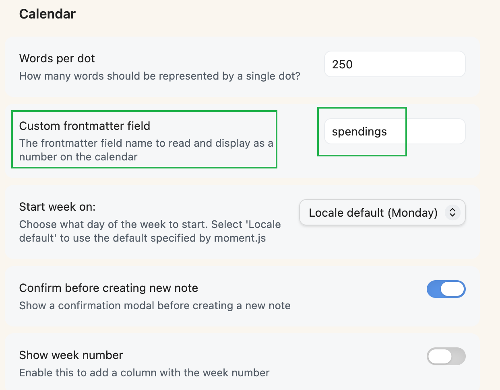

# obsidian-accounting-calendar

This plugin for [Obsidian](https://obsidian.md/) creates a simple Calendar view for visualizing and navigating between your daily notes forked from [liamcain](https://github.com/liamcain/obsidian-calendar-plugin)

## Features
- Show the `spendings` Frontmatter of notes in Calendar View.
- You can customize `spendings` in Setting Panel.
  

## Example of Daily .md Note 
[2026-08-30.md](./examples/2026-08-30.md)
- Add new line such as`SPENDINGS:: shopping： 42.69 （jd）` in your daily note.
- Use Dataview to auto-calculate all `SPENDINGS` in current file and show the total number in `spendings` Frontmatter.
