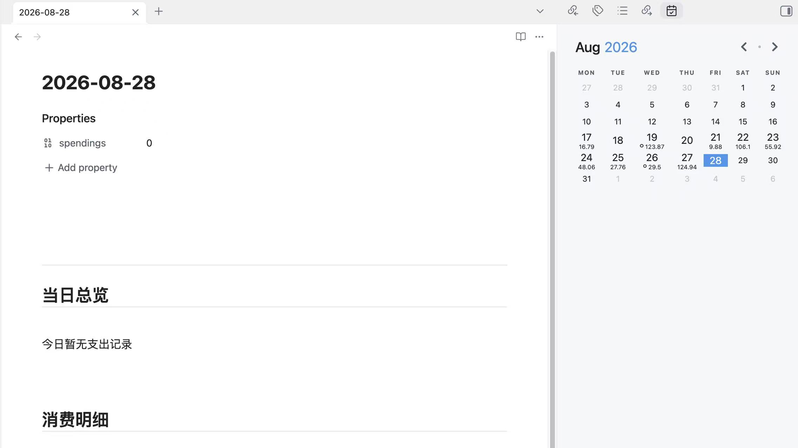

# obsidian-accounting-calendar

This plugin for [Obsidian](https://obsidian.md/) creates a simple Calendar view for visualizing and navigating between your daily notes forked from [liamcain](https://github.com/liamcain/obsidian-calendar-plugin)

## Features
- Show `spendings` numbers from note's Frontmatter on Calendar View.
- Edit `spendings` in Setting Panel.
